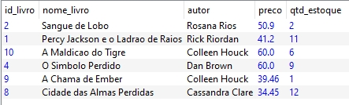
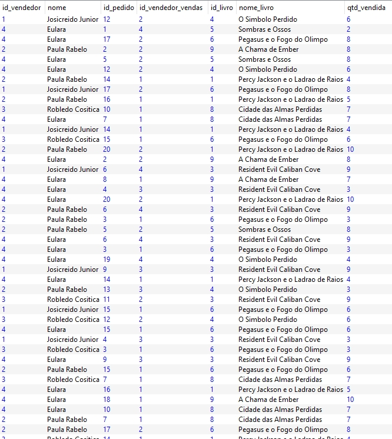

# Modelagem de banco de dados relacional: Álgebra Relacional

Aprendendo conceitos de álgebra relacional com base na teoria dos conjuntos; conhecendo operações e entendendo conceitos algébricos; aplicando operações no software Relational.

1. [Apresentação e instalação](#1-apresentação-e-instalação)
2. [Seleção e Projeção](#2-seleção-e-projeção)
3. [União, Interseção e Diferença](#3-união-interseção-e-diferença)
4. [Produto Cartesiano e Junção](#4-produto-cartesiano-e-junção)
5. [Outras operações](#5-outras-operações)

Saiba mais sobre o curso [aqui](https://cursos.alura.com.br/course/modelagem-banco-dados-algebra-relacional) ou acompanhe minhas anotações abaixo. ⬇️

## 1. Apresentação e instalação

> A Álgebra Relacional é uma linguagem de consulta formal, porém procedimental, ou seja, o usuário dá as instruções ao sistema para que o mesmo realize uma seqüência de operações na base de dados para calcular o resultado desejado. - [Devmedia](https://www.devmedia.com.br/algebra-relacional-tutorial/2663)

***Funções da Álgebra Relacional:***

São definidas nove operações para se trabalhar com álgebra relacional:

- `Union` União
- `Intersection` Intersecção
- `Difference` Diferença, Subtração
- `Product` Produto, Produto Cartesiano

Estas quatro operações são provenientes da teoria de conjuntos, da matemática.

- `Select` Seleção
- `Project` Projeção
- `Join` Junção
- `Divide` Divisão

Aplicam-se especificamente ao modelo de dados relacional.

- `Assignment` Designação, Atribuição

### **Conhecendo a ferramenta Relational**

Para baixar o Relational, basta acessar o link [aqui](https://ltworf.github.io/relational/index.html).

***Operadores do Relational:***

- `σ` seleção
- `π` projeção
- `∪` união
- `∩` interseção
- `-` diferença
- `*` produto
- `⋈` junção
- `ρ` renomear
- `➡` identificar

## 2. Seleção e Projeção

### **Seleção**

A `seleção` é uma operação que filtra as linhas para atender uma condição na relação entre as colunas.

> Indicada por `σ` (letra grega sigma), é uma operação que para um conjunto inicial fornecido como argumento, produz um subconjunto estruturalmente idêntico, mas apenas com os elementos do conjunto original que atendem a uma determinada condição (chamada de predicado). A seleção pode ser entendida como uma operação que filtra as linhas de uma relação(tabela), e é uma operação unária, pois opera sobre um único conjunto de dados.

***Operação com seleção:***

    σ nome_livro == 'Percy Jackson e o Ladrao de Raios' (livros)

***Comparadores de operação da álgebra relacional:***

- `>` maior que
- `<` menor que
- `>=` maior igual
- `<=` menor igual
- `=` igual
- `!=` diferente

### **Projeção**

A `projeção` é uma operação que gera novas relações, excluindo alguns atributos.

> Indicada por `π` (a letra grega pi) produz um conjunto onde há um elemento para cada elemento do conjunto de entrada, sendo que a estrutura dos membros do conjunto resultante é definida nos argumentos da operação. Pode ser entendida como uma operação que filtra as colunas de uma tabela. Por operar sobre apenas um conjunto de entrada é classificada como uma operação unária.

***Operação com projeção:***

    π nome_livro, preco, qtd_estoque (livros)

### **Desafio: Consulta com seleção e projeção**

***Seleção dentro da projeção:***

> Foi proposto que Arthur informasse o nome e a quantidade dos livros com itens em estoque maior ou igual a cinco.

    π nome_livro, qtd_estoque (σ qtd_estoque >= 5 (livros))

## 3. União, Interseção e Diferença

### **União**

A `união` é a operação que retorna a junção das linhas de duas relações com eliminação de duplicados.

> Produz como resultado uma Relação que contém todas as linhas da primeira Relação seguidas de todas as linhas da segunda tabela. A Relação resultante possui a mesma quantidade de colunas que as relações originais, e tem um número de linhas que é no máximo igual à soma das linhas das relações fornecidas como operandos, já que as linhas que são comuns a ambas as relações aparecem uma única vez no resultado.

***Operação com união:***

    π nome_livro (livros) ∪ π nome_livro (livros_novo)

### **Interseção**

A `interseção` é a operação que retorna linhas comuns entre as tabelas.

> Esta é uma operação adicional que produz como resultado uma tabela que contém, sem repetições, todos os elementos que são comuns às duas tabelas fornecidas como operandos. As tabelas devem ser união-compatíveis.

***Operação com interseção:***

    livros_estoque = π nome_livro (livros) ∪ π nome_livro (livros_novo)
    livros_estoque ∩ π nome_livro (vendas)

Obs. A partir da operação de união foi criada uma variável e esta foi utilizada para realizar a interseção.

### **Diferença**

A `diferença` é uma operação que retorna linhas presentes em uma tabela e ausentes em outra tabela.

> É uma operação que requer como operandos duas relações união-compatíveis, ou seja, estruturalmente idênticas. O resultado é uma relação que possui todas as linhas que existem na primeira relação e não existem na segunda.

***Operação com diferença:***

    livros_estoque - π nome_livro (vendas)

### **Praticando Interseção e Diferença**

***Seleção dentro da projeção:***

> Em uma conversa com o Artur, Josefina explicou que a interseção encontra as tuplas em comum entre as relações e a diferença encontra tuplas que não estão em comum entre as relações. Ao praticar esse conteúdo, Artur se deparou com um exercício que continha as seguintes relações:
>
> A (2,4,6,8,A,D) | B (1,2,3,4,5,6,7,8,9,B,C) | C (3,4,5,G)

    R = C ∩ (B-A) ---> R = (3,5) 

A diferença entre `B-A` retorna *R = (1,3,5,7,9, B, C)*.
A interseção entre `C ∩ (B-A)` retorna *R = (3,5)*.

### **Desafio: Indo além**

***Seleção com projeção e união:***

> Josefina passou no seguinte desafio para Arthur: Trazer o nome e o preço dos livros que tenham o valor maior ou igual a 30,00 reais na base de dados.

    maior_30 = σ preco >= 30 (livros)

    maior_30 = σ preco >= 30 (π nome_livro, preco (livros))

    maior_30 = σ preco >= 30 (π nome_livro, preco (livros) ∪ π nome_livro, preco(livros_novos))

## 4. Produto Cartesiano e Junção

### **Produto cartesiano**

O `produto cartesiano` é a operação que retorna todas as combinações de linhas de duas tabelas.

> O resultado do produto cartesiano de duas relações é uma terceira relação contendo todas as combinações possíveis entre os elementos das relacões originais. Essa relação resultante possuirá um número de colunas que é igual à soma das quantidades de colunas das duas relações iniciais, e um número de linhas igual ao produto do número de suas linhas.

***Operação com produto:***

    vendedores * vendas

### **Sobre o produto cartesiano**

> Supondo que temos uma relação A e uma relação B que possui os elementos indicados a seguir, qual seria a construção do produto cartesiano?
>
> A (Maria, José, Pedro) | B (Música, futebol, Artes)

    R = No produto cartesiano, todos os elementos presentes nas duas relações envolvidas, serão combinados.

### **Junção**

A `junção` é a operação que retorna a projeção do produto de duas tabelas selecionadas.

> É uma operação que produz uma combinação entre as linhas de uma relação com as linhas correspondentes de outra relação, sendo em princípio correspondente a uma seleção pelos atributos de relacionamento sobre um produto cartesiano dessas relações.

***Operação de junção:***

    vendedores ⋈ vendas
    vendas_novo = ρ id_vendedor_vendas ➡ id_vendedor (vendas)
    vendedores ⋈ vendas_novo

Realizando apenas a junção obtém-se o mesmo resultado que o produto cartesiano. Então é necessário criar uma variável para renomear uma coluna e, assim, criar uma relação entre as tabelas. Só depois realizar a junção.

### **Junção esquerda e direita**

A junção à esquerda prioriza as linhas da tabela à esquerda na operação. Assim como, a junção à direita prioriza as linhas da tabela à direita na operação. Complementando com nulo os demais resultados.

***Operação com junção à esquerda e à direita:***

    livros_estoque ⧑ vendas_novo

    livros_estoque ⧒ vendas_novo

### **Identificando a operação**

> É uma operação que produz uma combinação entre as linhas de uma tabela com as linhas correspondentes de outra tabela, sendo, em princípio, correspondente a uma seleção pelos atributos de relacionamento sobre um produto cartesiano das tabelas.

    A ⋈ B

A junção combina e faz uma seleção dos pares de tuplas encontradas em ambas relações, pois o produto cartesiano traz tuplas que não são de interesse.

### **Para saber mais: Junção total**

A `junção total` é o resultado das junções esquerda e direita.

> A junção total é representada pelo símbolo ⧓ e faz ambas as operações. Preenche as tuplas da entidade da esquerda que não encontram par na entidade da direita, assim como também preenche as tuplas da entidade da direita que não encontraram par na entidade da esquerda, adicionando-as ao resultado da junção. Ou seja, a junção total é a junção esquerda e direita juntas.

***Operação com junção total:***

    π id_pedido, nome_livro (livros_estoque ⧓ vendas_novo)

## 5. Outras operações

### **Atribuição**

Criar uma variável é o mesmo que atribuir um nome para uma operação.

    R = π nome_livro (livros) ∪ π nome_livro (livros_novo)

    S = π nome_livro (vendas)

    R - S

### **Praticando atribuição**

> Como realizar a consulta abaixo utilizando atribuição?

    π nome_livro, qtd_vendida (σ qtd_vendida >= 3 (vendas))

É necessário dividir a operação, atribuindo um nome para a primeira parte. Depois utilizar a variável criada para realizar a segunda operação, que também pode receber uma atribuição.

    Temp = σ qtd_vendida >= 3 (vendas)
    Resultado = π nome_livro, qtd_vendida (Temp)

### **Renomear**

O `renomear` é a operação que altera o nome de uma relação e/ou dos seus atributos.

> Esta operação unária primitiva redefine o nome de uma tabela em um determinado contexto. É útil para auto-relacionamentos, onde precisamos fazer a junção de uma tabela com ela mesma, e nesse caso cada versão da tabela precisa receber um nome diferente da outra.

***Operação de renomear:***

    livros_estoque = π nome_livro (livros) ∪ nome_livro (livros_novo)
    livros_estoque = livros ∪ livros_novo

    ρ autor ➡ autor_livro (livros_estoque)
    livros_estoque = ρ autor ➡ autor_livro (livros_estoque)

    livros_estoque = ρ nome_livro ➡ nome_do_livro, qtd_estoque ➡ quantidade_estoque (livros_estoque)

### **Desafio: Juntando todas as operações**

> Como recuperar o nome do vendedor, a quantidade vendida, nome e preço dos livros que tiveram vendas menores que oito e depois renomear os campos do resultado final?

***União das tabelas:***

    livros_estoque = livros ∪ livros_novo

***Junção da lista de livros com as vendas:***

    livros_venda = livros_estoque ⋈ vendas_novo

***Junção da lista de vendedores:***

    vendas_vendedores = vendas_novo ⋈ vendedores

***Obtendo o resultado final:***

    resultado = σ qtd_vendida < 8 (π nome, qtd_vendida, nome_livro, preco (livros_venda ⋈ vendas_vendedores))

Saiba mais sobre álgebra relacional:

- [Wikipédia](https://pt.wikipedia.org/wiki/Álgebra_relacional)
- [Macoratti](https://www.macoratti.net/13/06/sql_arcb.htm)

⬆️ [Voltar ao topo](#modelagem-de-banco-de-dados-relacional-álgebra-relacional) ⬆️